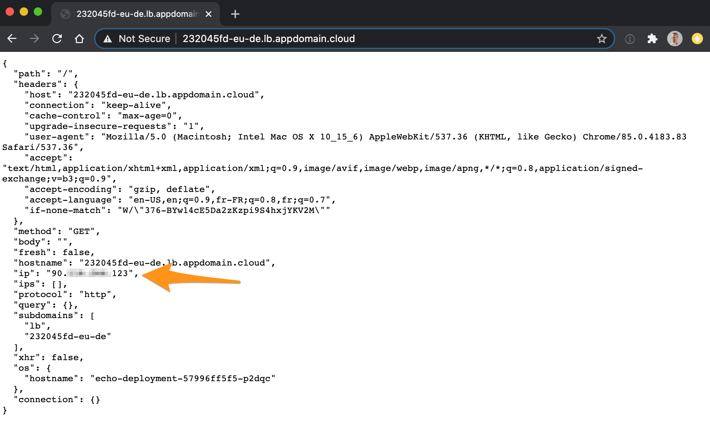

This sample shows how to preserve the source IP address of requests to apps in your cluster. 

The Docker image echoes various HTTP request properties back to client, as well as in docker logs. 



The original docker image was modified to use the [proxywrap library](https://github.com/cusspvz/proxywrap). This module is especially useful if you need to get the client IP address when you're behind an Load Balancer in TCP mode.

In HTTP or HTTPS mode (aka SSL termination at ELB), the ELB inserts X-Forwarded-For headers for you. However, in TCP mode, the ELB can't understand the underlying protocol, so you lose the client's IP address. With the PROXY protocol and this module, you're able to retain the client IP address with any protocol.

## Pre-requisites

* VPC Gen 2 and IKS cluster with Kubernetes 1.18 and later


## Resources

* [VPC: Exposing apps with VPC load balancers](https://cloud.ibm.com/docs/containers?topic=containers-vpc-lbaas)

## Usage

1. Build the docker image

    ```
    docker build -t <your-docker-repo>/http-https-echo .
    ```

1. Push the docker image
    ```
    docker push <your-docker-repo>/http-https-echo
    ```

1. Create a deployment yaml and echo-proxy.yaml
    ```yaml
    apiVersion: v1
    kind: Namespace
    metadata:
    name: echo

    ---
    apiVersion: apps/v1
    kind: Deployment
    metadata:
    name: echo-deployment
    namespace: echo
    labels:
        app: echo
    spec:
    replicas: 1
    selector:
        matchLabels:
        app: echo
    template:
        metadata:
        labels:
            app: echo
        spec:
        containers:
        - name: echo
            image: <your-docker-repo>/http-https-echo
            imagePullPolicy: Always
            ports:
            - containerPort: 80
            - containerPort: 443

    ---
    apiVersion: v1
    kind: Service
    metadata:  
    name: echo-service
    namespace: echo
    annotations:
        service.kubernetes.io/ibm-load-balancer-cloud-provider-enable-features: "proxy-protocol"
    spec:
    type: LoadBalancer
    selector:
        app: echo
    ports:  
    - name: http
        protocol: TCP
        port: 80
        targetPort: 80
    ```

1. Connect to your cluster
    ```
    ibmcloud ks cluster config -c <cluster-name>
    ```

1. Deploy this yaml in your cluster
    ```
    kubectl apply -f echo-proxy.yaml
    ```

1. A Load Balancer gets created in the VPC. Let's retrieve the hostname of this newly created LB.
    ```
    kubectl describe service echo-service -n echo
    ```
    Output:
    ```
    Name:                     echo-service
    Namespace:                echo
    Labels:                   <none>
    Annotations:              service.kubernetes.io/ibm-load-balancer-cloud-provider-enable-features: proxy-protocol
    Selector:                 app=echo
    Type:                     LoadBalancer
    IP:                       172.21.50.45
    LoadBalancer Ingress:     232045fd-eu-de.lb.appdomain.cloud
    Port:                     http  80/TCP
    TargetPort:               80/TCP
    NodePort:                 http  30066/TCP
    Endpoints:                172.17.79.11:80
    ```

1. Then issue a request via your browser or curl using the LoadBalancer Ingress in the output above.

    curl -k -X PUT -H "Arbitrary:Header" -d aaa=bbb 232045fd-eu-de.lb.appdomain.cloud

1. You should see the source IP in the ouput

    


